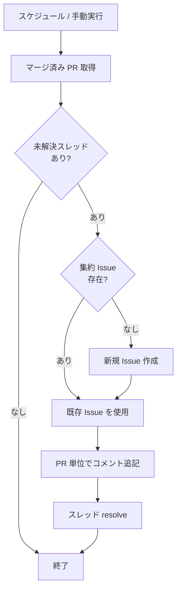

# 事後レビュースキャナー

## 概要

マージ済み PR に残った未解決のレビューコメントを定期的に検出し、集約 Issue にコメントとして記録するワークフロー。

## 背景

- マージ後に非同期でレビューコメントが投稿されるケースがあり、放置されやすい
- 事後指摘を定期的に拾い、Issue として可視化することで対応漏れを防ぐ

## 制約

- caller が提供するトークンの権限で動作する（PAT 不要）
- 必要な権限は「ワークフロー構成 > caller 要件」を参照

## トリガー条件

### プライマリトリガー

定期的なスケジュール実行。caller YAML で間隔を定義する。

### セカンダリトリガー

手動実行用（`workflow_dispatch`）。

## 処理フロー

1. スキャン範囲内にマージされた PR を取得
2. 各 PR の未解決レビュースレッドを検出
3. 検出がなければ終了
4. `auto:late-review` ラベル付きの Open な集約 Issue を検索し、存在しなければ新規作成
5. 検出した指摘を PR 単位でコメントとして追記
6. 記録済みスレッドを resolve（次回の重複検出防止）

### 集約 Issue

`auto:late-review` ラベル付きの Open Issue を常に1つだけ維持する。

Issue 本文は自動実装エージェントへの指示を兼ねる。以下の内容を含める:

- これはマージ済み PR に対する事後レビュー指摘の集約 Issue であること
- マージ後にコードが変更されている可能性が高く、指摘の行番号は参考値であること。該当箇所は探索して特定する必要があること
- 各コメントの指摘リンクから内容を把握し、該当箇所を探索して修正すること
- 大きな変更や判断が必要な場合は別 Issue を切ること
- ファイル削除等で対応不可の場合は別 Issue を立てること

#### ライフサイクル

- 管理者がコメントの指摘を確認し、全て対応完了したら Issue をクローズする
- クローズ後に新たな指摘が検出された場合は、新規 Issue を作成する

### コメント形式

PR 単位で1コメントを追記する:

- PR 番号・タイトル
- 各指摘のレビューコメントへのリンク

## 出力

### 集約 Issue

| 要素 | 内容 |
|---|---|
| ラベル | `auto:late-review` |
| 本文 | 自動実装向け指示 |
| コメント | PR 単位の指摘リンク集 |

### スレッド resolve

検出・記録済みのスレッドを resolve し、次回スキャンでの重複を防止する。

## エッジケース

| ケース | 振る舞い |
|---|---|
| 未解決スレッドが0件 | ログ出力のみ。Issue 作成・コメント追記なし |
| スレッドの resolve 失敗 | warning で続行。次回スキャンで再検出される |
| 集約 Issue 作成失敗 | エラー終了 |
| GitHub API 一時的障害 | warning で次の PR に継続 |
| GitHub API 認証・権限エラー | 即停止 |

## ワークフロー構成

shared-workflows リポジトリの Reusable Workflow として実装する。各リポジトリにはスケジュールトリガーの caller YAML を配置する。

### caller 要件

**permissions:**

- `contents: read`
- `pull-requests: write`（スレッド resolve）
- `issues: write`（集約 Issue 作成・コメント）

**secrets:** なし（`GITHUB_TOKEN` で動作）

### inputs

| 入力 | 説明 |
|---|---|
| `scan_hours` | スキャン範囲（マージからの経過時間） |

## 関連ドキュメント

- [auto-progress](auto-progress.md): 全体パイプライン仕様
- [copilot-auto-fix](copilot-auto-fix.md): Copilot レビュー検知 + 自動修正 + マージ
