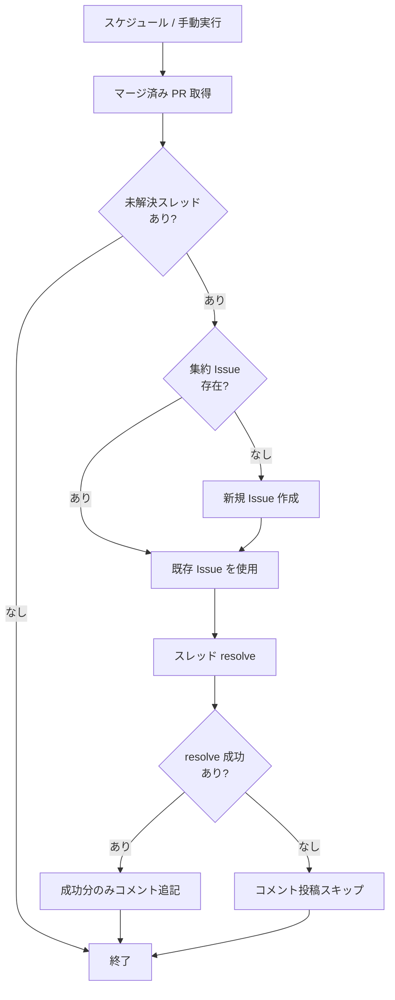

# 事後レビュースキャナー

## 概要

マージ済み PR に残った未解決のレビューコメントを定期的に検出し、集約 Issue にコメントとして記録するワークフロー。

## 背景

- マージ後に非同期でレビューコメントが投稿されるケースがあり、放置されやすい
- 事後指摘を定期的に拾い、Issue として可視化することで対応漏れを防ぐ

## 制約

- スキャン・Issue 操作は `GITHUB_TOKEN` で動作する
- スレッド resolve には PAT が必要（`GITHUB_TOKEN` ではマージ済み PR のスレッド resolve 権限がない）
- 必要な権限は「ワークフロー構成 > caller 要件」を参照

## トリガー条件

### プライマリトリガー

定期的なスケジュール実行。caller YAML で間隔を定義する。

### セカンダリトリガー

手動実行用（`workflow_dispatch`）。

## 処理フロー

1. スキャン範囲内にマージされた PR を取得
2. 各 PR の未解決レビュースレッドを検出
3. 検出がなければ終了
4. `auto:late-review` ラベル付きの Open な集約 Issue を検索し、存在しなければ新規作成
5. 各 PR について、検出したスレッドを 1 件ずつ resolve を試み、成功したスレッドの URL を成功リストに収集する（次回の重複検出防止）
6. PR 内の成功リストが 1 件以上あれば、resolve 成功したスレッドのみを集約 Issue へのコメントに含めて追記する（成功 0 件の PR はコメント投稿をスキップ）

```mermaid
flowchart TD
    A[スケジュール / 手動実行] --> B[マージ済み PR 取得]
    B --> C{未解決スレッド<br/>あり?}
    C -->|なし| D[終了]
    C -->|あり| E{集約 Issue<br/>存在?}
    E -->|あり| F[既存 Issue を使用]
    E -->|なし| G[新規 Issue 作成]
    G --> F
    F --> H[スレッド resolve]
    H --> I{resolve 成功<br/>あり?}
    I -->|あり| J[成功分のみコメント追記]
    I -->|なし| K[コメント投稿スキップ]
    J --> D
    K --> D
```

### 処理順の設計意図

コメント追記より先にスレッド resolve を試みる。PR 内のすべてのスレッドの resolve が成功しなかった場合は、当該 PR のコメント投稿をスキップして次の PR に進む。1 件でも resolve 成功があれば、成功した分のみをコメントに含めて投稿する。これにより以下を構造的に保証する:

- resolve トークン失効時、コメントだけが投稿されてスレッドが未解決のまま残り、次回 scan で同じスレッドが再検出されてコメントが増殖する事象を防ぐ
- 集約 Issue 上のコメントは「検出 + resolve 済みの記録」として一貫した意味を持つ

### 集約 Issue

`auto:late-review` ラベル付きの Open Issue を常に1つだけ維持する。

Issue 本文は自動実装エージェントへの指示を兼ねる。以下の内容を含める:

- これはマージ済み PR に対する事後レビュー指摘の集約 Issue であること
- マージ後にコードが変更されている可能性が高く、指摘の行番号は参考値であること。該当箇所は探索して特定する必要があること
- 各コメントの指摘リンクから内容を把握し、該当箇所を探索して修正すること
- 大きな変更や判断が必要な場合は別 Issue を切ること
- ファイル削除等で対応不可の場合は別 Issue を立てること

#### ライフサイクル

- 管理者がコメントの指摘を確認し、全て対応完了したら Issue をクローズする
- クローズ後に新たな指摘が検出された場合は、新規 Issue を作成する

### コメント形式

PR 単位で 1 コメントを追記する。コメントには resolve に成功したスレッドの分のみが含まれる:

- PR 番号・タイトル
- resolve 成功したスレッドのレビューコメントへのリンク

## 出力

### 集約 Issue

| 要素 | 内容 |
|---|---|
| ラベル | `auto:late-review` |
| 本文 | 自動実装向け指示 |
| コメント | PR 単位の指摘リンク集 |

### スレッド resolve

検出・記録済みのスレッドを resolve し、次回スキャンでの重複を防止する。

## エッジケース

| ケース | 振る舞い |
|---|---|
| 未解決スレッドが0件 | ログ出力のみ。Issue 作成・コメント追記なし |
| スレッドの resolve が認証/権限以外の理由で不成立（API 失敗・スレッド ID バリデーション失敗を含む） | warning で続行。当該スレッドはコメントに含めない（次回スキャンで再検出される） |
| PR 内の全スレッドの resolve が成功しなかった（認証/権限以外） | 当該 PR のコメント投稿をスキップ（コメント増殖防止） |
| 集約 Issue 作成失敗 | エラー終了 |
| GitHub API 一時的障害 | warning で次の PR に継続 |
| GitHub API 認証・権限エラー | すべての API 呼び出し（マージ済み PR 取得 / スレッド取得 / スレッド resolve）で即停止する。応答に `401`/`403`/`authentication`/`forbidden`/`resource not accessible`/`bad credentials` を検出して exit する |

## ワークフロー構成

shared-workflows リポジトリの Reusable Workflow として実装する。各リポジトリにはスケジュールトリガーの caller YAML を配置する。

### caller 要件

**permissions:**

- `contents: read`
- `pull-requests: write`（スレッド resolve）
- `issues: write`（集約 Issue 作成・コメント）

**secrets:**

- `REPO_OWNER_PAT`（スレッド resolve 用。`GITHUB_TOKEN` ではマージ済み PR のスレッドを resolve できない）

### inputs

| 入力 | 説明 |
|---|---|
| `scan_hours` | スキャン範囲（マージからの経過時間） |

## 関連ドキュメント

- [auto-progress](auto-progress.md): 全体パイプライン仕様
- [copilot-auto-fix](copilot-auto-fix.md): Copilot レビュー検知 + 自動修正 + マージ
